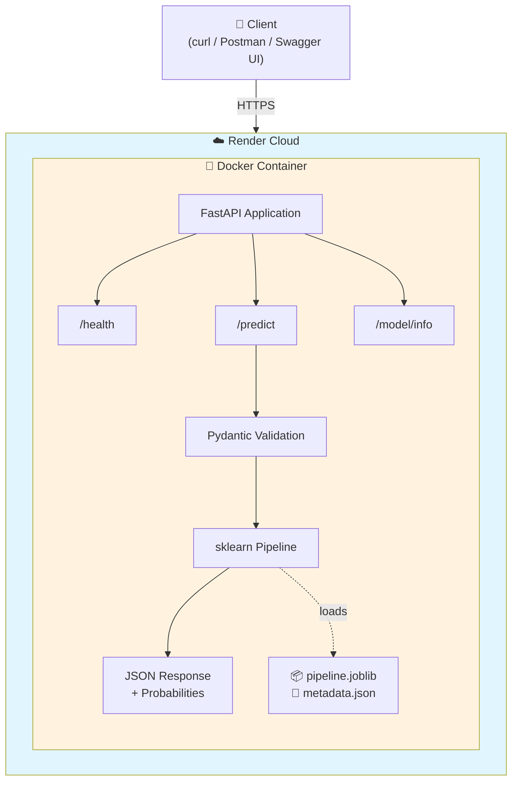
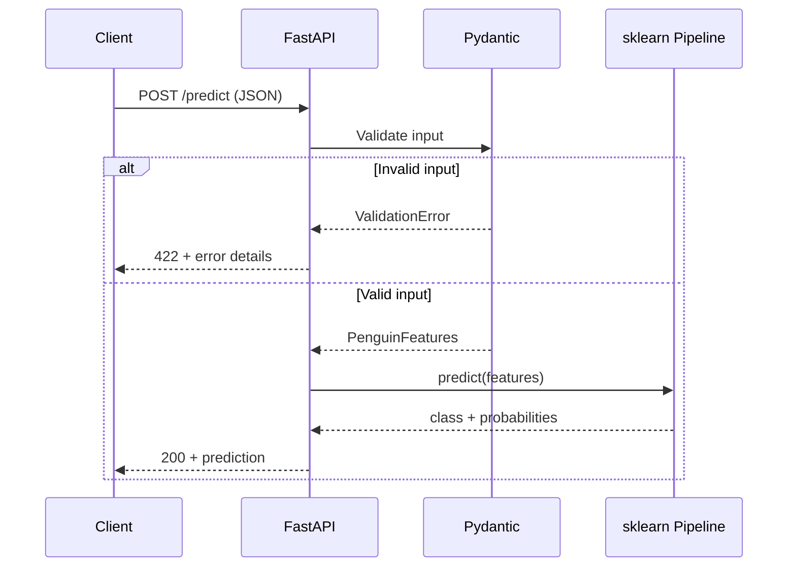
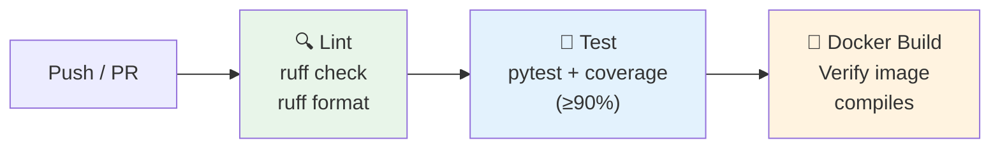

# 🐧 Penguin Species Predictor — Mini MLOps API

> Production-grade ML classification service deployed as a REST API with end-to-end MLOps best practices.

[](https://github.com/<tu-usuario>/penguin-ml-api/actions)
[](https://www.python.org/)
[](https://fastapi.tiangolo.com/)
[](https://scikit-learn.org/)
[](https://www.docker.com/)
[](#testing-strategy)
[](LICENSE)

<!-- TODO: Replace <tu-usuario> with your GitHub username in the CI badge above -->

---

## Table of Contents

1. [Executive Summary](#executive-summary)
2. [Key Features](#key-features)
3. [System Architecture](#system-architecture)
4. [Model Performance](#model-performance)
5. [API Reference](#api-reference)
6. [Installation](#installation)
7. [Usage](#usage)
8. [Configuration](#configuration)
9. [Testing Strategy](#testing-strategy)
10. [Docker](#docker)
11. [CI/CD Pipeline](#cicd-pipeline)
12. [Project Structure](#project-structure)
13. [Architecture Decision Records](#architecture-decision-records)
14. [Contributing](#contributing)
15. [License](#license)

---

## Executive Summary

### The Problem

A machine learning model sitting in a Jupyter notebook generates zero business value. The gap between "trained model" and "model in production" requires infrastructure, validation, monitoring, and deployment automation that most data science workflows lack.

### The Solution

This project delivers a **fully containerized REST API** that classifies penguin species (Adelie, Chinstrap, Gentoo) from morphological measurements. It demonstrates a complete MLOps pipeline — from reproducible training to cloud deployment — following industry best practices at every stage.

### Who Is This For

| Audience | Value Proposition |
|----------|-------------------|
| **Technical Leaders** | Reference architecture for deploying ML models as production microservices |
| **ML Engineers** | Reproducible pipeline with validation gates, golden dataset regression tests, and CI/CD |
| **Data Scientists** | Clear path from trained model to deployed endpoint with Pydantic contracts |
| **DevOps Engineers** | Multi-stage Docker build, health checks, structured logging, non-root container |

### Scope

| Included | Excluded |
|----------|----------|
| Reproducible training pipeline | Automatic retraining (drift detection) |
| REST API with strict Pydantic validation | Web frontend / UI |
| Docker multi-stage build + Render deploy | Kubernetes orchestration |
| CI/CD with GitHub Actions | Continuous Deployment to production |
| Health checks + structured logging | Prometheus/Grafana monitoring |
| Unit, integration, and E2E tests | Load testing / stress testing |

---

## Key Features

- **Multi-class Classification** — Predicts 3 penguin species with calibrated probability outputs
- **Strict Input Validation** — Pydantic v2 schemas with biologically plausible range enforcement
- **Reproducible Training** — Deterministic pipeline with `random_state=42`, YAML-configured hyperparameters
- **Golden Dataset Regression** — 10 curated samples guarantee prediction stability across deployments
- **Model Versioning** — SHA256 artifact integrity checks, metadata with training lineage
- **Docker-Ready** — Multi-stage build, non-root user, HEALTHCHECK directive
- **95% Test Coverage** — 34 tests across 3 levels (unit, integration, E2E)
- **Auto-Generated API Docs** — Swagger UI at `/docs`, OpenAPI spec at `/openapi.json`

---

## System Architecture



### Request Flow



---

## Model Performance

### Classification Report

| Species | Precision | Recall | F1-Score | Support |
|---------|-----------|--------|----------|---------|
| Adelie | 1.00 | 1.00 | 1.00 | 29 |
| Chinstrap | 1.00 | 1.00 | 1.00 | 14 |
| Gentoo | 1.00 | 1.00 | 1.00 | 24 |
| **Weighted Avg** | **1.00** | **1.00** | **1.00** | **67** |

### Model Summary

| Metric | Value |
|--------|-------|
| Algorithm | Random Forest Classifier |
| Accuracy (test set) | **1.00** (threshold: ≥0.95) |
| Training samples | 266 |
| Test samples | 67 |
| Split strategy | Stratified 80/20 |
| Features | 4 numeric + 2 categorical |
| Target classes | 3 (Adelie, Chinstrap, Gentoo) |
| Pipeline SHA256 | `4c785fa3cc13...` |

### Hyperparameters

| Parameter | Value | Rationale |
|-----------|-------|-----------|
| `n_estimators` | 100 | Sufficient for dataset size, diminishing returns beyond |
| `max_depth` | 10 | Prevents overfitting on 333 samples |
| `min_samples_split` | 5 | Regularization for small dataset |
| `min_samples_leaf` | 2 | Ensures leaf generalization |
| `random_state` | 42 | Full reproducibility |

### Golden Dataset Validation

| Metric | Value |
|--------|-------|
| Curated samples | 10 |
| Species coverage | Adelie (4), Chinstrap (3), Gentoo (3) |
| Prediction match | **10/10** (100%) |
| Min confidence score | 0.9355 |
| Probability tolerance | ±0.01 |

<!-- 📊 IMAGE SUGGESTION: Confusion matrix heatmap (3x3) showing perfect classification -->
<!-- 📊 IMAGE SUGGESTION: Bar chart comparing per-class F1 scores -->

---

## API Reference

### `POST /predict` — Classify Penguin Species

**Request Body:**

```json
{
  "bill_length_mm": 39.1,
  "bill_depth_mm": 18.7,
  "flipper_length_mm": 181.0,
  "body_mass_g": 3750.0,
  "sex": "male",
  "island": "Torgersen"
}
```

**Input Validation Rules:**

| Field | Type | Range | Allowed Values |
|-------|------|-------|----------------|
| `bill_length_mm` | float | 25.0 – 65.0 | — |
| `bill_depth_mm` | float | 12.0 – 22.0 | — |
| `flipper_length_mm` | float | 170.0 – 240.0 | — |
| `body_mass_g` | float | 2500.0 – 6500.0 | — |
| `sex` | string | — | `"male"`, `"female"` |
| `island` | string | — | `"Torgersen"`, `"Biscoe"`, `"Dream"` |

> Ranges are derived from the Palmer Penguins dataset min/max with ~10% margin.

**Response `200 OK`:**

```json
{
  "prediction": "Adelie",
  "probabilities": {
    "Adelie": 1.0,
    "Chinstrap": 0.0,
    "Gentoo": 0.0
  },
  "model_version": "1.0.0"
}
```

**Response `422 Validation Error`:**

```json
{
  "detail": [
    {
      "loc": ["body", "bill_length_mm"],
      "msg": "Input should be greater than or equal to 25.0",
      "type": "greater_than_equal"
    }
  ]
}
```

### `GET /health` — Service Health Check

```json
{
  "status": "healthy",
  "model_loaded": true,
  "model_version": "1.0.0",
  "timestamp": "2026-03-25T12:00:00+00:00"
}
```

### `GET /model/info` — Model Metadata

```json
{
  "model_version": "1.0.0",
  "model_type": "RandomForestClassifier",
  "training_date": "2026-03-25",
  "accuracy": 1.0,
  "features": ["bill_length_mm", "bill_depth_mm", "flipper_length_mm", "body_mass_g", "sex", "island"],
  "target_classes": ["Adelie", "Chinstrap", "Gentoo"],
  "pipeline_sha256": "4c785fa3cc13348fc60780dabbc69f787fe65d0f0a3de5bc19a989885d1e770c"
}
```

---

## Installation

### Prerequisites

| Tool | Version | Required For |
|------|---------|-------------|
| Python | ≥3.11 | All stages |
| Git | Any | Version control |
| Docker Desktop | ≥24 | Containerization (optional) |
| Make | Any | Command shortcuts (optional) |

### Windows (PowerShell)

```powershell
# Clone repository
git clone https://github.com/<tu-usuario>/penguin-ml-api.git
cd penguin-ml-api

# Create virtual environment
python -m venv .venv
.venv\Scripts\Activate.ps1

# Install dependencies (development)
pip install -e ".[dev]"

# Configure environment
copy .env.example .env

# Train model
python -m training.train

# Run tests
pytest

# Start API
uvicorn app.main:app --reload --port 8000
```

### Linux / macOS

```bash
# Clone repository
git clone https://github.com/<tu-usuario>/penguin-ml-api.git
cd penguin-ml-api

# Create virtual environment
python3 -m venv .venv
source .venv/bin/activate

# Install dependencies (development)
pip install -e ".[dev]"

# Configure environment
cp .env.example .env

# Train model
make train

# Run tests
make test

# Start API
make serve
```

### Platform Differences

| Operation | Windows (PowerShell) | Linux / macOS |
|-----------|---------------------|---------------|
| Activate venv | `.venv\Scripts\Activate.ps1` | `source .venv/bin/activate` |
| Train model | `python -m training.train` | `make train` |
| Run tests | `pytest` | `make test` |
| Start server | `uvicorn app.main:app --reload --port 8000` | `make serve` |
| Build Docker | `docker build -t penguin-ml-api .` | `make docker-build` |

> **Note:** `make` is available on Windows via [GnuWin32](http://gnuwin32.sourceforge.net/packages/make.htm), [Chocolatey](https://chocolatey.org/) (`choco install make`), or WSL. Without it, use the PowerShell commands directly.

---

## Usage

### Quick Verification

After starting the API, open your browser at **http://localhost:8000/docs** for the interactive Swagger UI.

### cURL Examples

```bash
# Health check
curl http://localhost:8000/health

# Predict species
curl -X POST http://localhost:8000/predict \
  -H "Content-Type: application/json" \
  -d '{
    "bill_length_mm": 39.1,
    "bill_depth_mm": 18.7,
    "flipper_length_mm": 181.0,
    "body_mass_g": 3750.0,
    "sex": "male",
    "island": "Torgersen"
  }'

# Model metadata
curl http://localhost:8000/model/info
```

### Python Example

```python
import httpx

response = httpx.post(
    "http://localhost:8000/predict",
    json={
        "bill_length_mm": 46.1,
        "bill_depth_mm": 13.2,
        "flipper_length_mm": 211.0,
        "body_mass_g": 4500.0,
        "sex": "female",
        "island": "Biscoe",
    },
)
data = response.json()
print(f"Species: {data['prediction']}")
print(f"Confidence: {max(data['probabilities'].values()):.1%}")
```

### Expected Outputs by Species

| Input Profile | Expected Prediction | Typical Confidence |
|---------------|--------------------|--------------------|
| Short bill, deep bill, Torgersen | Adelie | >99% |
| Long bill, shallow bill, Dream | Chinstrap | >93% |
| Long flipper, heavy body, Biscoe | Gentoo | >99% |

---

## Configuration

### Environment Variables

| Variable | Default | Description |
|----------|---------|-------------|
| `APP_ENV` | `development` | Environment identifier |
| `APP_HOST` | `0.0.0.0` | Server bind address |
| `APP_PORT` | `8000` | Server port |
| `MODEL_PATH` | `model/pipeline.joblib` | Path to trained pipeline |
| `METADATA_PATH` | `model/metadata.json` | Path to model metadata |
| `LOG_LEVEL` | `INFO` | Logging verbosity |

Configure via `.env` file (copy from `.env.example`) or system environment variables.

### Training Configuration

All training hyperparameters are centralized in `training/config.yaml`:

```yaml
model:
  type: RandomForestClassifier
  params:
    n_estimators: 100
    max_depth: 10
    min_samples_split: 5
    min_samples_leaf: 2
    random_state: 42

thresholds:
  min_accuracy: 0.95
```

---

## Testing Strategy

### Test Pyramid

```
           ╱╲
          ╱ E2E ╲            4 tests — Golden dataset regression
         ╱────────╲
        ╱Integration╲       11 tests — API endpoints via TestClient
       ╱──────────────╲
      ╱    Unit Tests    ╲   19 tests — Schemas + prediction logic
     ╱────────────────────╲
```

### Test Summary

| Level | File | Tests | What It Validates |
|-------|------|-------|-------------------|
| **Unit** | `test_schemas.py` | 15 | Pydantic validation: valid input, boundary values, out-of-range, invalid enums, missing fields, wrong types |
| **Unit** | `test_predict.py` | 4 | Prediction logic: response keys, valid class output, probability sum ≈ 1.0, version passthrough |
| **Integration** | `test_api.py` | 11 | Full endpoint tests: 200/422 responses, health check, model info, content validation |
| **E2E** | `test_golden.py` | 4 | Golden dataset: size, exact prediction match, probability tolerance (±0.01), species coverage |
| | | **34 total** | **95% coverage** |

### Running Tests

**Linux / macOS:**
```bash
make test               # All tests
make test-unit          # Unit only
make test-integration   # Integration only
make test-e2e           # E2E / golden dataset only
make test-coverage      # With HTML coverage report
```

**Windows (PowerShell):**
```powershell
pytest                                          # All tests
pytest tests/unit/ -v                           # Unit only
pytest tests/integration/ -v                    # Integration only
pytest tests/e2e/ -v                            # E2E only
pytest --cov=app --cov-report=term-missing      # With coverage
```

---

## Docker

### Build & Run

```bash
# Build image
docker build -t penguin-ml-api .

# Run container
docker run -d -p 8000:8000 --name penguin-api penguin-ml-api

# Verify
curl http://localhost:8000/health

# Stop
docker stop penguin-api && docker rm penguin-api
```

### Docker Compose (Development)

```bash
docker compose up       # Foreground
docker compose up -d    # Background
docker compose down     # Stop
```

### Image Specifications

| Property | Value |
|----------|-------|
| Base image | `python:3.11-slim` |
| Build strategy | Multi-stage (builder + runtime) |
| Runtime user | `appuser` (non-root, UID 1000) |
| Image size | ~514 MB |
| Health check | Built-in HEALTHCHECK directive |
| Exposed port | 8000 |

---

## CI/CD Pipeline

### GitHub Actions Workflow

The CI pipeline (`.github/workflows/ci.yml`) triggers on every push to `main` and on pull requests.



| Stage | Tool | Gate |
|-------|------|------|
| **Lint** | Ruff | Zero warnings, correct formatting |
| **Test** | Pytest | 34/34 tests pass, ≥90% coverage |
| **Build** | Docker | Image builds without errors |

---

## Project Structure

```
penguin-ml-api/
├── .github/workflows/
│   └── ci.yml                     # CI pipeline: lint → test → build
├── app/
│   ├── main.py                    # FastAPI app, lifespan, routes
│   ├── config.py                  # Settings via pydantic-settings
│   ├── schemas.py                 # Pydantic models (request/response)
│   ├── predict.py                 # Prediction logic
│   └── monitoring.py              # Health check utility
├── model/
│   ├── pipeline.joblib            # Serialized sklearn pipeline
│   └── metadata.json              # Version, metrics, SHA256
├── training/
│   ├── train.py                   # Reproducible training script
│   ├── evaluate.py                # Evaluation and metrics
│   └── config.yaml                # Hyperparameters (single source of truth)
├── data/golden/
│   ├── golden_inputs.json         # 10 curated regression inputs
│   └── golden_outputs.json        # Expected predictions + probabilities
├── tests/
│   ├── conftest.py                # Shared fixtures (client, valid_input)
│   ├── unit/                      # Schema + prediction tests
│   ├── integration/               # API endpoint tests
│   └── e2e/                       # Golden dataset validation
├── scripts/
│   └── test_live.py               # Smoke test for deployed URL
├── docs/
│   ├── adr/                       # 6 Architecture Decision Records
│   └── postman/                   # Postman collection
├── Dockerfile                     # Multi-stage production build
├── docker-compose.yml             # Local development
├── Makefile                       # Unified commands
├── pyproject.toml                 # Dependencies + tool configuration
└── .env.example                   # Environment variables template
```

---

## Architecture Decision Records

All major technical decisions are documented as ADRs in `docs/adr/`:

| ADR | Decision | Key Rationale |
|-----|----------|---------------|
| [001](docs/adr/001-dataset-penguins.md) | Palmer Penguins dataset | Mixed feature types, 3 classes, real-world data, requires real preprocessing |
| [002](docs/adr/002-model-random-forest.md) | Random Forest + sklearn Pipeline | Strong multi-class baseline, serializable with preprocessing, no heavy dependencies |
| [003](docs/adr/003-framework-fastapi.md) | FastAPI | Native async, Pydantic v2 integration, automatic OpenAPI docs |
| [004](docs/adr/004-deploy-render.md) | Render (free tier) | Stable free tier, native Docker support, automatic HTTPS |
| [005](docs/adr/005-ci-github-actions.md) | GitHub Actions | Native GitHub integration, free for public repos |
| [006](docs/adr/006-serialization-joblib.md) | joblib serialization | Standard for sklearn pipelines, efficient with numpy arrays |

---

## Tech Stack

| Component | Technology | Version |
|-----------|-----------|---------|
| Language | Python | 3.11 |
| Web Framework | FastAPI | ≥0.115 |
| ML Framework | scikit-learn | ≥1.5 |
| Validation | Pydantic | v2 |
| Serialization | joblib | ≥1.4 |
| ASGI Server | Uvicorn | ≥0.30 |
| Linter/Formatter | Ruff | ≥0.8 |
| Testing | pytest | ≥8.0 |
| Container | Docker | ≥24 |
| CI/CD | GitHub Actions | — |
| Deployment | Render | Free tier |

---

## Contributing

### Code Style

- **Linter/Formatter:** Ruff (configured in `pyproject.toml`)
- **Line length:** 99 characters
- **Docstrings:** Google style
- **Type hints:** Required on all public functions

```bash
# Verify
make lint               # Linux/macOS
ruff check . && ruff format --check .   # Windows

# Auto-fix
make format             # Linux/macOS
ruff check --fix . && ruff format .     # Windows
```

### Commit Convention

```
feat:     New functionality
fix:      Bug fix
test:     Add or modify tests
docs:     Documentation changes
refactor: Code refactoring (no behavior change)
ci:       CI/CD changes
chore:    Maintenance tasks
```

### PR Workflow

1. Create branch from `main`: `feat/descriptive-name` or `fix/descriptive-name`
2. Develop with semantic commits
3. Open PR against `main`
4. CI must pass (lint + test + build)
5. Squash merge

---

## Glossary

| Term | Definition |
|------|-----------|
| **Pipeline (sklearn)** | Chained sequence of transformers + estimator, serialized as a single artifact |
| **Golden Dataset** | Fixed input/output set used as a regression test — any output change signals a pipeline change |
| **ADR** | Architecture Decision Record — documents a design decision, its context, and consequences |
| **Lifespan** | FastAPI pattern for running code at app startup/shutdown (e.g., loading model) |
| **Cold Start** | Delay (~30-60s) when Render free tier wakes a sleeping service |

---

## License

MIT

---

<p align="center">
  <sub>Built with 🐍 Python, ⚡ FastAPI, and 🧠 scikit-learn</sub>
</p>
